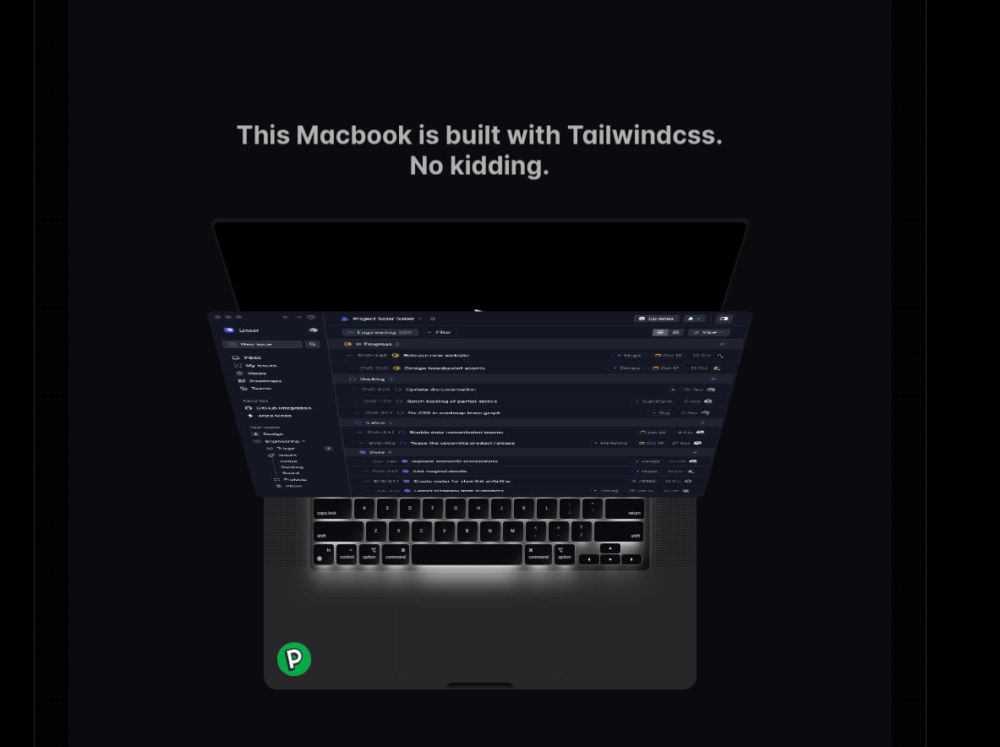

<div align=center>
<h1>Macbook</h1> 


</div>
<br>


## Components

Aceternity UI offers a wide range of components to help you build stunning interfaces. Here are some of the key components available in the library:

- **Buttons:** Create stylish buttons with various styles, sizes, and colors.
- **Cards:** Display content in elegant cards with customizable layouts.
- **Navigation Bars:** Build sleek navigation bars with dropdown menus and responsive designs.
- **Modals:** Create interactive modals for alerts, notifications, and user interactions.
- **Forms:** Design beautiful forms with input fields, checkboxes, radio buttons, and more.
- **Icons:** Access a library of icons to enhance your interface's visual appeal.

For a full list of components and their usage, refer to the Aceternity UI documentation.

## Installation

To install Aceternity UI in your project, you can use npm or yarn:
Example component

# Macbook Scroll

Scroll through the page and see the image come out of the screen.

`Hero` `Footer` `Scroll` `Image` `Parallax` `section`



# Installation

# Install dependencies

```bash
  npm i framer-motion clsx tailwind-merge @tabler/icons-react
```
# Add util file
 // utils/cn.ts

```ts
import clsx from 'clsx'
import { twMerge } from "tailwind-merge";
 
export function cn(...inputs: ClassValue[]) {
  return twMerge(clsx(inputs));
}
```
# Add the following code to your `tailwind.config.js` file
```js
 
const defaultTheme = require("tailwindcss/defaultTheme");
const colors = require("tailwindcss/colors");
const {
  default: flattenColorPalette,
} = require("tailwindcss/lib/util/flattenColorPalette");

/** @type {import('tailwindcss').Config} */
module.exports = {
  content: ["./src/**/*.{ts,tsx}"],
  darkMode: "class",
  theme: {
    // rest of the code
  },
  plugins: [
    // rest of the code
    addVariablesForColors,
  ],
};

// This plugin adds each Tailwind color as a global CSS variable, e.g. var(--gray-200).
function addVariablesForColors({ addBase, theme }: any) {
  let allColors = flattenColorPalette(theme("colors"));
  let newVars = Object.fromEntries(
    Object.entries(allColors).map(([key, val]) => [`--${key}`, val])
  );

  addBase({
    ":root": newVars,
  });
}

```

# Main Component
Click this for more details 
[Aceternity UI](https://ui.aceternity.com/components/macbook-scroll)

# Components Used in this project
- **Macbook Scroll** : Scroll through the page and see the image come out of the screen.
- **Spotlight** : Highlight important content with a spotlight effect.
- **3D Card** : Create a 3D card that rotates on hover.
- **Tracing Beam** : Add a tracing beam effect to your text.
- **Bento Grid** : Create a responsive grid layout with bento boxes.
- **Card Stack** : Create a stack of cards that expand on hover.
- <b>Glowing Background Stars : Add a glowing starry background to your page.
- **Infinite Moving Cards** : Create an infinite loop of moving cards.
- **Sign Up Form** : Design a sleek sign-up form with input fields and buttons.
- **Animated Navigation** : Create an animated navigation bar with dropdown menus.
- **Animated Buttons** : Design stylish buttons with hover effects.
- **Animated Icons** : Add animated icons to your interface.
- **Animated Text** : Create text animations with various effects.
- **Animated Illustrations** : Add animated illustrations to your page.
- **Animated Background** : Design a dynamic background with animated elements.
- **Animated Tabs** : Create animated tabs with smooth transitions.
- **Text Reveal Cards** : Design cards with text that reveals on hover.
- **Multi-Step Loader** : Create a multi-step loader animation.
- **Background Gradient** : Add a gradient background to your page.
- **Hover Effects** : Design elements with hover effects.

# For more Components Installation

<a href="/Comp/readme.md"></a>
