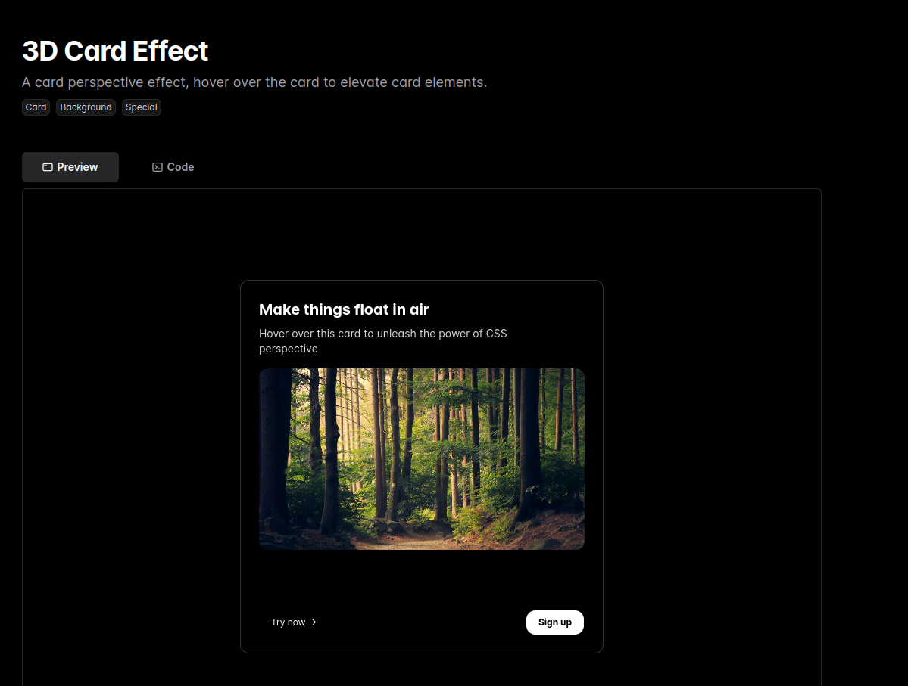

<div align=center>
<h1>Macbook</h1> 


</div>
<br>

# Installation


# 3D Card Effect
  A card perspective effect, hover over the card to elevate card elements.</br>
`Card` `Background` `Special`

## Install dependencies

```bash
npm i framer-motion clsx tailwind-merge
```

## Add util file

// utils/cn.ts

``` bash
import { ClassValue, clsx } from "clsx";
import { twMerge } from "tailwind-merge";

export function cn(...inputs: ClassValue[]) {
  return twMerge(clsx(inputs));
}
```
Now create a Component/ui/3d-card.tsx

Copy and paste the code and in the component put the main code that has been given the official website 

# Tracing Beam
A Beam that follows the path of an SVG as the user scrolls. Adjusts beam length with scroll `speed` `Content` `Scroll` `Utility`


## Install dependencies

```bash
npm i framer-motion clsx tailwind-merge
```

## Add util file

// utils/cn.ts

``` bash
import { ClassValue, clsx } from "clsx";
import { twMerge } from "tailwind-merge";

export function cn(...inputs: ClassValue[]) {
  return twMerge(clsx(inputs));
}
```
Now create a Component/ui/tracing-beam.tsx
After this 

Copy and paste the code and in the component put the main code that has been given the official website.
# EverVault Card


## Install dependencies

```bash
npm i framer-motion clsx tailwind-merge
```

## Add util file

// utils/cn.ts

``` bash
import { ClassValue, clsx } from "clsx";
import { twMerge } from "tailwind-merge";

export function cn(...inputs: ClassValue[]) {
  return twMerge(clsx(inputs));
}
```
Now create a Component/ui/tracing-beam.tsx
After this 

Copy and paste the code and in the component put the main code that has been given the official website.

# BentoGrid 


## Install dependencies

```bash
npm i framer-motion clsx tailwind-merge @tabler/icons-react
```

## Add util file

// utils/cn.ts

``` bash
import { ClassValue, clsx } from "clsx";
import { twMerge } from "tailwind-merge";

export function cn(...inputs: ClassValue[]) {
  return twMerge(clsx(inputs));
}
```
Now create a Component/ui/bento-grid.tsx
After this 

Copy and paste the code and in the component put the main code that has been given the official website.

# GlowingBackgroundGradient


## Install dependencies

```bash
npm i framer-motion clsx tailwind-merge
```

## Add util file

// utils/cn.ts

``` bash
import { ClassValue, clsx } from "clsx";
import { twMerge } from "tailwind-merge";

export function cn(...inputs: ClassValue[]) {
  return twMerge(clsx(inputs));
}
```
Now create a Component/ui/glowing-stars.tsx
After this 

Copy and paste the code and in the component put the main code that has been given the official website.

# HoverEffect


## Install dependencies

```bash
npm i framer-motion clsx tailwind-merge
```

## Add util file

// utils/cn.ts

``` bash
import { ClassValue, clsx } from "clsx";
import { twMerge } from "tailwind-merge";

export function cn(...inputs: ClassValue[]) {
  return twMerge(clsx(inputs));
}
```
Now create a Component/ui/hover-effect.tsx
After this 

Copy and paste the code and in the component put the main code that has been given the official website.

# InfiniteMovingCards
A customizable group of cards that move infinitely in a loop. Made with Framer Motion and Tailwind CSS.
`Testimonials` `Utility` `Marquee`


## Install dependencies

```bash
npm i framer-motion clsx tailwind-merge
```

## Add util file

// utils/cn.ts

``` bash
import { ClassValue, clsx } from "clsx";
import { twMerge } from "tailwind-merge";

export function cn(...inputs: ClassValue[]) {
  return twMerge(clsx(inputs));
}
```
Now create a Component/ui/infinite-moving-cards.tsx
After this 

Copy and paste the code and in the component put the main code that has been given the official website.

# Spotlight
A spotlight effect with Tailwind CSS, good for drawing attention to a particular element on the page.
`Hero` `Footer` `Section` `Special`


## Install dependencies

```bash
npm i framer-motion clsx tailwind-merge
```

## Add util file

// utils/cn.ts

``` bash
import { ClassValue, clsx } from "clsx";
import { twMerge } from "tailwind-merge";

export function cn(...inputs: ClassValue[]) {
  return twMerge(clsx(inputs));
}
```
Now create a Component/ui/Spotlight.tsx
After this 

Copy and paste the code and in the component put the main code that has been given the official website.

# Text Reveal Card 

Mousemove effect to reveal text content at the bottom of the card.
`Text` `Content` `Hero` `Section` `Special` `Card`


## Install dependencies

```bash
npm i framer-motion clsx tailwind-merge
```

## Add util file

// utils/cn.ts

``` bash
import { ClassValue, clsx } from "clsx";
import { twMerge } from "tailwind-merge";

export function cn(...inputs: ClassValue[]) {
  return twMerge(clsx(inputs));
}
```
Now create a Component/ui/text-reveal-card.tsx


After this 

Copy and paste the code and in the component put the main code that has been given the official website.

# Animated Tabs
Tabs to switch content, click on a tab to check background animation.
`Hero` `Features` `Product` `Utility`


## Install dependencies

```bash
npm i framer-motion clsx tailwind-merge
```

## Add util file

// utils/cn.ts

``` bash
import { ClassValue, clsx } from "clsx";
import { twMerge } from "tailwind-merge";

export function cn(...inputs: ClassValue[]) {
  return twMerge(clsx(inputs));
}
```
Now create a Component/ui/tabs.tsx
After this 

Copy and paste the code and in the component put the main code that has been given the official website.


